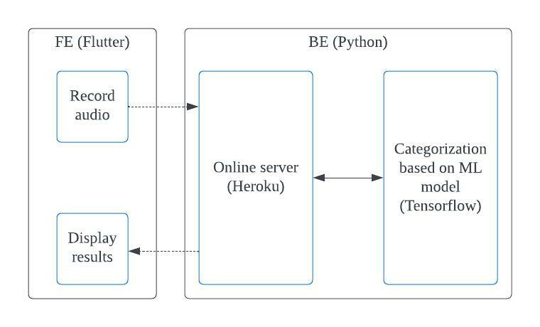

# mimi4me

## Description
This repositry is for developing an application [Solution Challenge 2022](https://developers.google.com/community/gdsc-solution-challenge). The challenge aims to solve for one or more of the United Nations 17 Sustainable Development Goals using Google technology.

## What is mimi4me?

Our app, "mimi4me" provides an additional warning in dangerous situations by alerting the user through vibration when loud sounds are detected. It also shows a rough decibel count of the noise and a list of possible causes of the noise.

## Our Goals for the solution challenge

One specific issue we wanted to deal with was the increase in pedestrian injuries and fatalities involving moving vehicles. While looking into this problem, we saw that a large portion of these accidents involved pedestrians wearing earphones or headphones. Due to the continuous development of noise-canceling features, it gets easier to miss important warning sounds such as train whistles and car honks. Our goal through this project was to decrease the number of accidents related to noise-canceling headphones.

## Architecture and Technology



- Fronted(UI) - **Flutter/Darts (Android)** 
- Backend - Flask/Python(Keras/Tensorflow)
- Infrastructure - Heroku Server

---
---

# How to run

## Backend

### Requirements
- python 3 installed
- ngrok installed - Download from https://ngrok.com/download

### How to run(locally)
1. Go to the backend folder
``` 
cd backend
```
2. Install required libraries
```
pip install -r requirements.txt
```
3. Run the flask server
```
python main.py
```
4. Run ngrok server
```
ngrok http http://127.0.0.1:5000/
```
5. Copy https tunnel made by ngrok server 
```
Forwarding                    https://269f-2405-6581-9960-6500-3dcc-3085-257e-5d24.ngrok.io -> http://127.0.0.1:5000

In above case,
https://269f-2405-6581-9960-6500-3dcc-3085-257e-5d24.ngrok.io
```
6. Proceed to the Frontend Execution

## Frontend

### Requirements
- java version 11 installed
- darts & flutter installed (check the working version below)
- backend flask server must be working
- have finished tunneling to ngrok server

### Works in
- On local only
- Dart SDK version: 
    - 2.16.1 (stable)
- Flutter
    - 2.10.2

### How to run
1. Go to the mimi4me directory
``` 
cd mimi4me
```
2. Install required packages
```
dart pub get
```
3. Enter environmental variables [.env](/mimi4me/.env). (The apiUrl below is obtained to tunnel using ngrok server)

```
apiUrl=https://sample.ngrok.io -> local server
apiUrl=https://murmuring-hamlet-18265.herokuapp.com/ -> deployed server
```
4. Run the app on your device
```
flutter run
```
5. Click the record button and wait for few seconds

### Acknowledgements

Reference for Machine Learning
- Prabhavsingh. “UrbanSound8K - Classification.” Kaggle, Kaggle, 16 Mar. 2020, https://www.kaggle.com/code/prabhavsingh/urbansound8k-classification/notebook?fbclid=IwAR3RIRwc9GrBzJ8qboCbCMHVBflFf1_IgjABkxt3uiRnS5yyNHjxCAOovnk.

Reference for Icon
- Ear by Andreas Wikström from NounProject.com
